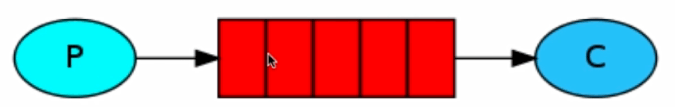
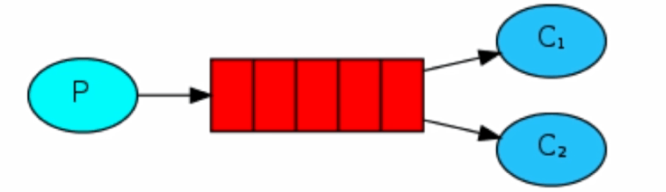
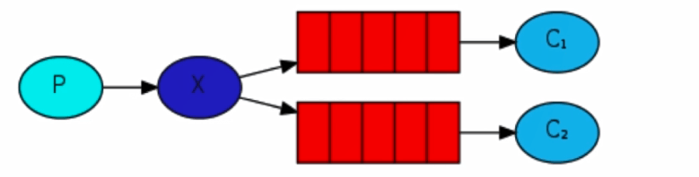
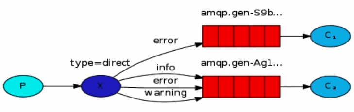
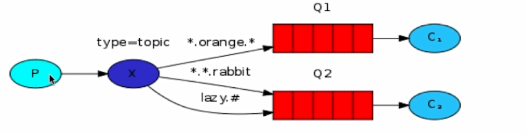

# RabbitMQ

## 安装

使用 docker 安装

```bash
docker run -d \
 --name rabbitmq \
 -p 5672:5672 \
 -p 15672:15672 \
 -e RABBITMQ_DEFAULT_USER=admin \
 -e RABBITMQ_DEFAULT_PASS=123456 \ 
 rabbitmq:3.8.3-management
```

## 管理界面

浏览器访问 http://localhost:15672

## 概念

### 虚拟主机 vhost

虚拟主机，vhost，是一个独立的消息队列服务器，拥有自己的队列、交换机、绑定和权限机制，用作隔离不同应用的环境。

### 交换机 exchange

交换机，exchange，是消息的分发中心，它有一系列规则，用来把从生产者发来的消息路由到队列中。

### 队列 queue

队列，queue，是消息的载体和存储的地方，也是消息最终被消费的地方。

### 绑定 binding

绑定，binding，是交换机和队列之间的虚拟连接，binding 中可以包含 routing key。

### 消息 message

消息，message，是消息队列中的数据单元，由消息头和消息体组成。

## 工作模式

### 1. 简单模式 Simple

简单模式是最简单的工作模式，一个生产者，一个消费者，生产者向队列发送消息，消费者从队列中获取消息并消费。



### 2. 工作模式 Work

工作模式是在简单模式的基础上，增加了多个消费者，多个消费者监听同一个队列，当有消息到达时，队列会把消息分发给其中一个消费者。



### 3. 发布/订阅模式 Publish/Subscribe

发布/订阅模式是在工作模式的基础上，增加了交换机，生产者将消息发送到交换机，交换机将消息分发给所有绑定到交换机的队列，队列再将消息发送给消费者。



### 4. 路由模式 Routing

路由模式是在发布/订阅模式的基础上，增加了路由键，生产者将消息发送到交换机，交换机将消息分发给所有绑定到交换机的队列，队列再将消息发送给消费者，但是队列可以设置路由键，消费者只有在路由键匹配的情况下才能消费消息。



### 5. 主题模式 Topic

主题模式是在路由模式的基础上，增加了通配符，生产者将消息发送到交换机，交换机将消息分发给所有绑定到交换机的队列，队列再将消息发送给消费者，但是队列可以设置路由键，消费者只有在路由键匹配的情况下才能消费消息，路由键可以使用通配符。



### 6. RPC 模式

客户端远程调用服务端的方法。
